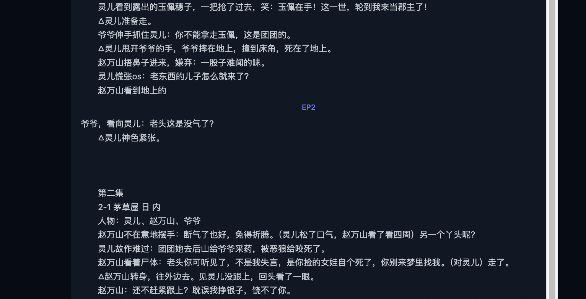

1，左边剧本区的高度太高，需要往下滚很久。要求固定成浏览器的高度。
2，分集指示线显示有错位，但落盘文件是正确分集的。需要检查

3，顶部分集下拉框不会自动更新，返回项目或者刷新，才能更新。
3.1，剧本管理页面的二阶段里，中间分集剧本全文默认要展开，不要收起来
4，原本的设置页里面的LLM配置，右边的内容不现实了，是不是路由错了。还有其他几个好像也缺失了。
5，分镜页里，右侧抽屉的编辑分镜页面的配色不合理，而且太高了，高度需要调整不超过浏览器的高度。
6，质检页面中的描述，有很多显示了很多位小数，我们一般取整数。
7，资产中心里，资产卡片需要个页面的全局按钮，可以一键全部资产卡片全部展开或者收起。还有变体展开也需要有页面级全局开关。